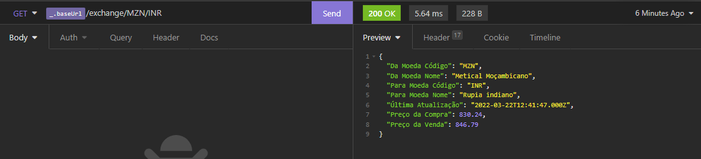

<h1 align="center">
  
</h1>

  

 

This is Economist, system designed to have all mozambican economic information. 

### Features: 
- Business
  - PIB
- Demography 
  - Mozambican population, province, and each district
    - Ordered by age
    - Ordered by sex
    - Ordered by region
  - Population Marital Status
  - Population Energy Sources
  - Population Water Fountain
  - Population Home Ownership
- Housing 
  - Mozambican Regions
- Exchange Rates
  - Currencies (28 currencies information and their flags)
  - Crypto Currencies (10 currencies information and their flags)
  - Exchange Rates from Mozambican Currency to foreign currencies or foreign currencies to Mozambican Currency
  - Exchange Rates from any of the currencies to crypto currencies or crypto to currencies
- Monetary Policy
  - Balance of Payment (BoP)
    - Balance of services
      - The Last year Balance
      - All Balance since 2005
    - Balance of Trade
      - The Last year Balance
      - All Balance since 2005
    - Current account
      - The Last year Balance
      - All Balance since 2005
    - Primary Income
      - The Last year Balance
      - All Balance since 2005
    - Secondary Income
      - The Last year Balance
      - All Balance since 2005
  - Inflation (Consumer Price Index)
    - For the whole country
      - Current Month inflation (Monthly, Homologous and Accumulated Variation)
      - All inflation histories since 2015 (Monthly, Homologous and Accumulated Variation)
    - For a Group of Products
      - Current Month inflation (Monthly, Homologous and Accumulated Variation)
      - All inflation histories since 2015 (Monthly, Homologous and Accumulated Variation)
  - Interest Rates
    - Current Interest Rates
    - Interest Rate histories Since 01-01-2015

<h1 align="center">
  
</h1>